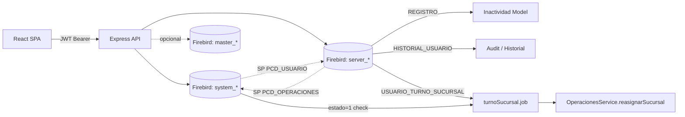

# Módulo Usuarios — Plataforma de Administración

> Refactorización moderna del formulario `frm_principal` / **Menú de Accesos** del sistema legado (Delphi/WinForms sobre Firebird) hacia un stack **Node.js + Express + React/TypeScript**, arquitectura **MVC**, autenticación **JWT** y codificación **UTF‑8** end‑to‑end.

Última actualización: **10‑07‑2026**. Ver historial de cambios en [`CHANGELOG.md`](CHANGELOG.md).

---

## 1. Resumen ejecutivo

El módulo administra el ciclo de vida completo de los **usuarios** y sus **accesos** distribuidos en múltiples ejes, replicando 1‑a‑1 la lógica de negocio del sistema legado pero con una capa de UI/UX moderna, API REST tipada y validación exhaustiva.

### 1.1 Funcionalidades implementadas

| # | Módulo | Estado | Descripción |
|---|---|---|---|
| 1 | **Login / JWT** | ✅ | Access (15 min) + refresh (7 d), guard de rutas, claims `iduser/idperfil/idempresa`. Audita éxitos (op 12) y fallos (op 13) en `HISTORIAL_USUARIO`. **Refresh transparente**: el cliente renueva el access token vencido de forma automática ante un `401` y reintenta la petición, sin expulsar al usuario (ver §5.19). |
| 2 | **Usuarios — CRUD** | ✅ | Alta (SP `PCD_USUARIO`), baja lógica, edición, sugerencia de `iduser`, validación de documento. |
| 3 | **Usuarios — Operaciones** | ✅ | Reset clave, reasignar sucursal, cambiar perfil — todas vía `PCD_OPERACIONES` (auditadas). |
| 4 | **Usuarios — DataGrid** | ✅ | Buscador, filtros por columna (perfil, estado, texto libre), selección naranja, accesos directos. Filtro rápido **Sin documento** con toggle en toolbar. Barra de leyenda de badges siempre visible. |
| 5 | **Usuarios — Badges informativos** | ✅ | `Database` (violeta) = replica a BD Master · `AlertTriangle` ámbar = sin menús configurados · `AlertTriangle` azul = sin documento · `Sliders` ámbar = permisos personalizados (excluido de última propagación). |
| 6 | **Usuarios — Complemento** | ✅ | `modo_print`, `talonario`, `descuento` opcionales por usuario. |
| 7 | **Usuarios — Historial** | ✅ | Modal paginado (25/50/100 filas) con navegación `«/»` y descripción de operaciones desde `HISTORIAL_USUARIO` JOIN `TIPO_OPERACION`. |
| 8 | **Usuarios — Export CSV** | ✅ | Descarga `usuarios_YYYY-MM-DD.csv` (BOM UTF-8, separador `;`) **generado en el cliente** con exactamente las filas visibles según los filtros, badges y orden de la grilla (ver §5.19b). Incluye columnas `Perfil` y `Sucursal`. |
| 9 | **Usuarios — Inactividad** | ✅ | Detección de cuentas sin actividad en `REGISTRO` (BD server) según umbral configurable. Vista dedicada con selección múltiple, inhabilitación unitaria y por lote (máx 100). |
| 10 | **Usuarios — Sucursal actual** | ✅ | `EditarUsuarioModal` muestra sucursal principal (orden 1) en campo solo-lectura, cargada lazy. Texto hint orienta al botón de reasignación. |
| 11 | **Usuarios — Reasignación de Sucursal + Calendario** | ✅ | `ReasignarSucursalModal` con dos secciones: (a) **Reasignar ahora** (efecto inmediato con auditoría OP.5); (b) **Calendario mensual** con tres modos de selección (Día / Rango / Semanal), paleta de 8 colores por sucursal, clic derecho para quitar, **Limpiar mes** (vacía todo el mes de un click), **Copiar al siguiente mes** (replica asignaciones preservando días válidos). |
| 12 | **Roles / Perfiles** | ✅ | CRUD de `TIPO_USUARIO` + edición de plantilla compartiendo el editor de Accesos. Badge `Database` en roles con flag `MASTER=1`. |
| 13 | **Roles — Propagación de permisos** | ✅ | `PropagateRolModal` con checkboxes individuales por usuario, pre-marcado de excluidos (`exclusion_permisos=1`). Se auto-dispara tras cada guardado exitoso en `RoleAccesosPage`. Procesamiento tolerante a fallos: errores por usuario se acumulan (no abortan el resto). Usuarios **sin documento** se procesan parcialmente (menus/permisos copiados, `exclusion_permisos` omitido por constraint Firebird) y se informan en panel ámbar separado. |
| 14 | **Accesos — Menú Gestión** | ✅ | `MENU_GENERAL` jerárquico con flag `PERMISO 0/1`. |
| 15 | **Accesos — Permisos Generales** | ✅ | `USUARIOEMPRESA.PERMISOS` (string S/N de 50 posiciones). |
| 16 | **Accesos — Movimientos** | ✅ | `USUARIOEMPRESA.MOVIMIENTOS` (string S/N) + sincronización con `mnuAdmMovimientos{N}`. |
| 17 | **Accesos — Conceptos** | ✅ | `USUARIO_CONCEPTO` por tipo de movimiento: permiso + `permiso_varios` (15 chars). |
| 18 | **Accesos — Personalización por usuario** | ✅ | 5 overrides en `USUARIO_CONCEPTO`: talonario, vendedor, persona, planventa, condición. |
| 19 | **Accesos — Punto de Venta** | ✅ | `USUARIOEMPRESA.MENU_GG_2` + catálogo `TMP$USUARIO_PERMISOS_PDV`. |
| 20 | **Accesos — Contab. / RRHH** | ✅ | `USUARIOEMPRESA.PERMISO_GG` por módulo con sub‑permisos. |
| 21 | **Accesos — Sucursales** | ✅ | `USUARIO_SUCURSAL` (DELETE+INSERT, sin PK en legacy). |
| 22 | **Accesos — Depósitos** | ✅ | `USUARIO_DEPOSITO` (salida) + `USUARIO_DEPOSITO1` (entrada). |
| 23 | **Accesos — Dirty detection real** | ✅ | `AccesosEditor` usa snapshots `JSON.stringify` vía `useRef` para detectar cambios reales. No genera falsos positivos al navegar entre pestañas sin modificar datos. |
| 24 | **Catálogos públicos** | ✅ | Perfiles, sucursales, depósitos, talonarios, vendedores, planventas, condiciones, operaciones. |
| 25 | **Catálogo de operaciones** | ✅ | `GET /api/catalogos/operaciones` — devuelve el catálogo declarativo con descripción de efectos y BD afectada por operación. Consumido en modal "¿Qué ocurre?". |
| 26 | **Configuración del entorno** | ✅ | `CONFIGURACION_USUARIO` por IP (admite `localhost`), flag `AUTORIZADO/MASTER`, umbral de inactividad `DIAS_INACTIVIDAD` (default 90). |
| 27 | **Auditoría — Viewer global** | ✅ | Módulo dedicado `GET /auditoria` con datagrid paginado (server-side) sobre `HISTORIAL_USUARIO`. Filtros: usuario (CONTAINING), operación (combo 13 tipos), autorización, rango de fechas. Ordenación por cualquier columna. Exportación CSV página actual + CSV todos (máx. 5 000 filas). Botón Imprimir/PDF via `window.print()`. |
| 27b | **Reportes — Ficha Usuario** | ✅ | Informe completo de un usuario: datos básicos, sucursales, depósitos, complemento, vínculos (legajo RH + mesero GG), permisos chips, menú habilitado, conceptos por tipo, historial reciente (25 filas). Botón Imprimir/PDF. |
| 27c | **Reportes — Ficha Rol** | ✅ | Informe completo de un rol/perfil: datos básicos, permisos/movimientos/PDV/GG chips, menú, conceptos, usuarios asignados (con badge de exclusión). Reutiliza helpers de `FichaUsuarioReporte`. |
| 28 | **Job cron — Inactividad** | ✅ | Escaneo automático de inactividad (lunes 06:00). Solo registra candidatos en log; no inhabilita automáticamente. Controlado por `ENABLE_INACTIVIDAD_JOB=1`. |
| 29 | **Job cron — Calendario de sucursal** | ✅ | Aplica diariamente (04:00 AM por defecto) las asignaciones programadas en `USUARIO_TURNO_SUCURSAL`. Verifica estado activo del usuario **en tiempo de ejecución** (BD system) — usuarios dados de baja a mitad de mes son omitidos aunque tengan días en el calendario. Llama `OperacionesService.reasignarSucursal()` (incluye GG_MESERO + auditoría OP.5). Configurable con `ENABLE_TURNO_SUCURSAL_JOB=1` / `TURNO_SUCURSAL_CRON`. |
| 30 | **Importación masiva** | ✅ | CSV/TSV/TXT (separador auto: TAB/`;`/`,`), cabecera opcional, hasta 200 filas. Pre-validación cliente (duplicados de documento, campos vacíos). Validación server (perfil habilitado+plantilla, documento único, sucursal activa). Alta atómica — un solo `TRANSACTION` system: si falla cualquier fila, ROLLBACK de todo el lote. Errores detallan tabla exacta (`[USUARIO]`, `[MENU_GENERAL]`, etc.). TXT de errores en Escritorio. Post-effects (legajo, gastronomía, masterSync, auditoría) fuera de la tx en best-effort. |
| 31 | **Legajos** | 🟡 pendiente | Datos de RRHH del usuario (vinculación con `LEGAJO`). |
| 32 | **Biometría** | 🟡 pendiente | Captura/enrollment huella + sincronización dispositivos. |
| 33 | **Tests E2E** | 🟡 pendiente | Playwright cubriendo flujos críticos. |

### 1.2 Mejoras frente al sistema original

- **UI minimalista, densa y responsive** (React + Tailwind), reemplazando el WinForms con grillas compactas tipo legado pero con tipografía consistente.
- **Capa de servicio** que oculta los strings posicionales (`S/N`, `0/1`) y expone JSON tipado.
- **JWT** en lugar de sesiones Firebird directas.
- **Transacciones explícitas** desde Node (`node-firebird`) en vez de `AUTONOMOUS TRANSACTION` anidadas dentro de SPs.
- **Validación Zod** simétrica en cliente y servidor; errores normalizados.
- **Multi-cliente / multi-empresa** vía `.env` (un par de BDs `system` + `server` por instalación).
- **Auditoría completa** de login y todas las operaciones en `HISTORIAL_USUARIO`.
- **Detección de inactividad** basada en datos reales de `REGISTRO`, con umbral configurable.
- **Export CSV** de usuarios generado en el cliente: exporta solo lo que se ve en la grilla (filtros, badges y orden actuales).
- **Sesión resiliente**: refresh automático del JWT vencido con reintento transparente de la petición; el usuario ya no es expulsado al login por un token caducado.
- **Calendario de sucursal** con programación mensual, modos Día/Rango/Semanal, paleta visual, copia entre meses y aplicación automática diaria vía cron.
- **Propagación de permisos tolerante a fallos**: errores por usuario individualizados; usuarios sin documento procesados parcialmente sin abortar el resto.
- **Snapshots de dirty detection**: sin falsos positivos en el editor de accesos.
- **Leyenda de badges** permanente en la grilla de usuarios.
- **Módulo Auditoría** con datagrid global de `HISTORIAL_USUARIO`, filtros CONTAINING (Firebird), paginación server-side y exportación CSV doble (página/todos).
- **Módulo Reportes** (Ficha Usuario + Ficha Rol) imprimibles/PDF con todos los accesos, permisos y vínculos.

---

## 2. Arquitectura

```
Usuarios/
├── README.md
├── BaseDatos.txt              # notas de DDL del sistema legado
├── package.json               # monorepo (scripts dev/build)
├── server/                    # API REST (Node 20 + Express 4) — MVC
│   ├── package.json
│   ├── sql/                       # migraciones idempotentes
│   │   ├── run-migration.js       # runner: OK / WARN(duplicado) / FAIL
│   │   ├── 03_login_audit.sql     # pobla TIPO_OPERACION (13 tipos)
│   │   └── 04_inactividad.sql     # DIAS_INACTIVIDAD column + 2 índices REGISTRO
│   └── src/
│       ├── app.js                 # bootstrap Express (helmet, cors, rate-limit)
│       ├── server.js              # listen + arranca job cron
│       ├── config/
│       │   ├── env.js             # carga + valida .env
│       │   ├── firebird.js        # pools system + server + master, helpers query/transaction
│       │   └── operaciones.config.js  # catálogo declarativo de 13 operaciones (fuente de verdad)
│       ├── middlewares/
│       │   ├── auth.js            # verify JWT
│       │   ├── error.js           # handler central
│       │   ├── validate.js        # Zod
│       │   └── requireAuthorized.js   # verifica flag AUTORIZADO en CONFIGURACION_USUARIO
│       ├── jobs/
│       │   ├── inactividad.job.js         # cron lunes 06:00 — solo log
│       │   └── turnoSucursal.job.js       # cron 04:00 — aplica USUARIO_TURNO_SUCURSAL
│       ├── models/                # acceso a datos
│       │   ├── usuario.model.js       # _listar(opts), listar(), exportar()
│       │   ├── operaciones.model.js   # altaCompleta = altaSystemPart(system) + altaServerPart(server) anidados
│       │   ├── inactividad.model.js   # listar(umbralDias?, {idperfilFiltro})
│       │   ├── historial.model.js     # registrar() + listarGlobal(filtros+paginación)
│       │   ├── menu.model.js
│       │   ├── permiso.model.js
│       │   ├── catalogo.model.js
│       │   ├── concepto.model.js
│       │   ├── configuracion.model.js # + umbralInactividad()
│       │   ├── rol.model.js           # listarUsuariosPorRol — usa NOT EXISTS + estado=1
│       │   ├── usuarioSucursal.model.js
│       │   ├── usuarioDeposito.model.js
│       │   └── usuarioTurno.model.js  # listarMes / reemplazarMes (USUARIO_TURNO_SUCURSAL)
│       ├── controllers/
│       │   ├── auth.controller.js         # login + auditoría OP 12/13
│       │   ├── usuario.controller.js      # listar, exportCsv, historial, sucursalPrincipal, turnosMes, guardarTurnosMes
│       │   ├── inactividad.controller.js  # listar, inhabilitar (1 o lote)
│       │   ├── accesos.controller.js
│       │   ├── rol.controller.js          # + listarUsuarios, propagar
│       │   ├── catalogo.controller.js     # + operaciones()
│       │   ├── auditoria.controller.js    # listar global con filtros
│       │   ├── reportes.controller.js     # fichaUsuario + fichaRol
│       │   └── configuracion.controller.js
│       ├── services/
│       │   ├── permisos.service.js    # encode/decode strings posicionales
│       │   ├── operaciones.service.js # altaUsuario / altasBatch / baja / reset / reasignarSucursal
│       │   ├── masterSync.service.js  # sincronización BD master
│       │   ├── accesos.service.js     # obtenerCompleto / guardar / propagarDesdeRol (tolerante a fallos + sin_documento[])
│       │   └── reportes.service.js    # fichaUsuario + fichaRol (paralleliza fetches)
│       ├── routes/
│       │   ├── index.js
│       │   ├── auth.routes.js
│       │   ├── usuario.routes.js      # + /:iduser/sucursal-principal + /:iduser/turnos
│       │   ├── accesos.routes.js
│       │   ├── rol.routes.js          # + /:idperfil/usuarios + /:idperfil/propagar
│       │   ├── catalogo.routes.js
│       │   ├── auditoria.routes.js    # GET /auditoria
│       │   ├── reportes.routes.js     # GET /reportes/usuario/:id + /reportes/rol/:id
│       │   └── configuracion.routes.js
│       └── utils/
│           ├── logger.js          # pino
│           ├── jwt.js
│           └── audit.js           # auditar(req) / auditarDirecto() — best-effort
│
└── client/                    # SPA React 18 + Vite + TS + Tailwind
    ├── package.json
    ├── tailwind.config.js
    ├── vite.config.ts
    ├── index.html
    └── src/
        ├── main.tsx
        ├── App.tsx                        # rutas: /usuarios/inactividad añadida
        ├── api/
        │   ├── client.ts                  # axios + interceptor JWT
        │   └── endpoints.ts               # tipos + funciones API (incl. exportCsv, inactividad, historial)
        ├── auth/
        │   └── AuthContext.tsx
        ├── components/
        │   ├── layout/AppLayout.tsx       # nav: UserMinus → /usuarios/inactividad
        │   └── OperacionesInfoModal.tsx   # modal "¿Qué ocurre?" — lista operaciones con badges BD
        ├── features/
        │   ├── login/LoginPage.tsx
        │   ├── usuarios/
        │   │   ├── UsuariosPage.tsx               # botones: Agregar → Importar → Exportar CSV; + ReasignarSucursalModal
        │   │   ├── UsuariosDataGrid.tsx            # filtros columna, barra de leyenda, sin-doc toggle, MapPin, History, Power
        │   │   ├── HistorialUsuarioModal.tsx       # historial paginado
        │   │   ├── InactividadPage.tsx             # detección y gestión de cuentas inactivas
        │   │   ├── ReasignarSucursalModal.tsx      # reasignación inmediata + calendario mensual + copiar mes
        │   │   ├── AgregarUsuarioModal.tsx
        │   │   ├── EditarUsuarioModal.tsx          # muestra sucursal actual (lazy)
        │   │   └── ImportarUsuariosModal.tsx
        │   ├── roles/RolesPage.tsx
        │   ├── auditoria/
        │   │   └── AuditoriaPage.tsx              # datagrid global HISTORIAL_USUARIO + filtros + CSV + print
        │   ├── reportes/
        │   │   ├── ReportesPage.tsx               # selector tipo (usuario/rol) + buscador + imprimir
        │   │   ├── FichaUsuarioReporte.tsx         # informe completo + helpers exportados
        │   │   └── FichaRolReporte.tsx             # informe de rol (reutiliza helpers)
        │   ├── configuracion/ConfiguracionPage.tsx
        │   └── accesos/
        │       ├── AccesosPage.tsx
        │       ├── RoleAccesosPage.tsx             # auto-propaga después de cada guardado exitoso
        │       ├── AccesosEditor.tsx               # snapshot dirty detection; prop onGuardadoExitoso
        │       ├── PropagateRolModal.tsx           # checkboxes por usuario; panel errores; panel sin-documento
        │       └── tabs/
        │           ├── MenuTab.tsx
        │           ├── FlagsTab.tsx
        │           ├── PdvTab.tsx
        │           ├── ConceptosTab.tsx
        │           ├── MasterPanel.tsx
        │           ├── SucursalesTab.tsx
        │           └── DepositosTab.tsx
        └── styles/index.css
```

### 2.1 Flujo de datos



### 2.2 Convención clave: rol == usuario plantilla

En el legacy, los roles **son usuarios sintéticos** con un `iduser` propio almacenado en `tipo_usuario.iduser`. Las tablas `usuario_concepto`, `usuario_sucursal`, `usuario_deposito*`, `menu_general`, `usuarioempresa` se llenan tanto para usuarios reales como para roles‑plantilla.

**Cambio de perfil = "Reemplazar todo" (implementado en Node, 2026-07-10):** al asignar un rol real a un usuario, `OperacionesService.cambiarPerfil` (además de actualizar `idtipo_usuario`) **copia todos los accesos de la plantilla del rol al usuario** vía `AccesosService.aplicarRolAUsuario` → `_copiarPlantillaAUsuario` (el mismo helper que usa `propagarDesdeRol`). Copia `MENU_GENERAL` + `USUARIOEMPRESA` (permisos/movimientos/PDV/GG) + `USUARIO_CONCEPTO` + `USUARIO_SUCURSAL` + `USUARIO_DEPOSITO` + `USUARIO_DEPOSITO1` (las sucursales/depósitos del rol se copian como línea base, personalizable luego por usuario) y fija `exclusion_permisos = 0`. Solo aplica a `idperfil > 0`: "Sin Rol" (0) y "Sin Asignación" (-1) no tienen plantilla. Es best‑effort: si la copia falla, el cambio de etiqueta no se revierte (se puede completar con «Propagar» desde el rol). Como el helper es compartido, la **propagación** (`propagarDesdeRol`, auto‑disparada al editar un rol) también reemplaza sucursales/depósitos del usuario con los del rol.

> **Respeta "Personalizado" (`exclusion_permisos = 1`, ver §5.14):** si el usuario está marcado como personalizado, `cambiarPerfil` cambia el perfil pero **no** copia los accesos del rol (preserva su config propia) y devuelve un `detalle` informativo. La propagación ya lo respeta vía las casillas pre‑desmarcadas del `PropagateRolModal`.

El componente `AccesosEditor` recibe una prop `scope: 'rol' | 'usuario'` que activa/desactiva la personalización por usuario sin duplicar código.

### 2.3 Exclusión de plantillas de rol en grillas y módulos

Los usuarios que son plantilla de rol se excluyen de `UsuariosDataGrid`, `InactividadPage` y `exportar()`.

Filtro aplicado en `_listar` (grilla de usuarios):
```sql
u.iduser NOT IN (SELECT iduser FROM tipo_usuario WHERE iduser IS NOT NULL)  -- plantillas de rol
AND UPPER(TRIM(u.iduser)) <> 'ADMIN'                                        -- superusuario reservado
```

> **Nota (2026-07-10):** ya **no** se filtra por `idtipo_usuario <> -1`. Los usuarios `-1` ("Sin Asignación", legados pendientes) **sí aparecen** en la grilla (fila deshabilitada, solo "Modificar/Asignar perfil"; ver §5.20). Las plantillas de rol —que también son `-1`— siguen excluidas por el `NOT IN` sobre `tipo_usuario.iduser`. `InactividadPage` y otros módulos que aún usan `<> -1` mantienen su comportamiento (no consideran pendientes ni plantillas).

---

## 3. Tecnologías

| Capa | Tecnología | Motivo |
|---|---|---|
| Frontend | **React 18 + Vite + TypeScript** | DX rápida, build optimizado, tipado estricto. |
| UI | **Tailwind CSS** + **lucide-react** | Diseño consistente, iconos vectoriales. |
| Estado servidor | **@tanstack/react-query v5** | Cache, invalidaciones, lazy loading por pestaña. |
| Tablas | **@tanstack/react-table** | Grillas virtualizadas con paginación, sort, filtros y drag‑and‑drop de columnas. |
| Notificaciones | **react-hot-toast** | Toasts no bloqueantes. |
| Validación | **Zod v3** | Esquemas compartidos client/server. |
| HTTP | **axios** | Interceptores, manejo de errores, `responseType: 'blob'` para CSV. |
| Backend | **Node.js 20 + Express 4** | Maduro, ecosistema amplio. |
| DB driver | **node-firebird** | Driver puro JS para Firebird 2.5+. |
| Auth | **jsonwebtoken** + bcrypt | JWT HS256 + hash de claves. |
| Logs | **pino** | JSON estructurado, alto rendimiento. |
| Jobs | **node-cron ^3** | Job semanal de detección de inactividad. |
| Lint | **eslint** + **prettier** | Estilo uniforme. |
| Encoding | **UTF‑8** end‑to‑end | Charset Firebird `UTF8`, headers HTTP, BOM en CSV. |

---

## 4. Configuración multi-cliente

Cada instalación se gestiona con un `.env` por backend cambiando los nombres de base.

```env
# server/.env
PORT=3001
NODE_ENV=production
JWT_SECRET=cambiar_por_secreto_largo
JWT_EXPIRES=15m
JWT_REFRESH_EXPIRES=7d
CORS_ORIGIN=http://localhost:5173
DEFAULT_IDEMPRESA=1

# Base 'system' (autenticación + tipo_usuario + menu_general)
SYSTEM_HOST=192.168.0.10
SYSTEM_PORT=3050
SYSTEM_DATABASE=C:/BD/system_empresa1.fdb
SYSTEM_USER=SYSDBA
SYSTEM_PASSWORD=masterkey
SYSTEM_CHARSET=UTF8

# Base 'server' (datos operativos: conceptos, sucursales, depósitos, configuración, historial)
SERVER_HOST=192.168.0.10
SERVER_PORT=3050
SERVER_DATABASE=C:/BD/server_empresa1.fdb
SERVER_USER=SYSDBA
SERVER_PASSWORD=masterkey
SERVER_CHARSET=UTF8

# Base 'master' (replicación Contabilidad/RRHH — opcional)
MASTER_HOST=192.168.0.10
MASTER_PORT=3050
MASTER_DATABASE=C:/BD/master_empresa1.fdb
MASTER_USER=SYSDBA
MASTER_PASSWORD=masterkey
MASTER_CHARSET=WIN1252

# Job de inactividad (opcional — deshabilitado por defecto)
ENABLE_INACTIVIDAD_JOB=1        # omitir o poner 0 para deshabilitar
INACTIVIDAD_CRON=0 6 * * 1      # default: lunes 06:00
TZ=America/Asuncion
```

> **Configuración del entorno** (tabla `CONFIGURACION_USUARIO` en BD `server`): se administra desde la UI; admite `localhost` como IP. Incluye `DIAS_INACTIVIDAD INTEGER DEFAULT 90` para el umbral de inactividad.

---

## 5. Reglas de negocio críticas

### 5.1 Strings posicionales

| Campo | Long. | Codificación |
|---|---|---|
| `USUARIOEMPRESA.PERMISOS` | 50 | `S/N` por posición (Permisos Generales). |
| `USUARIOEMPRESA.MOVIMIENTOS` | 20 | `S/N`; el índice = valor `tipo` en `TIPOMOVIMIENTO`. |
| `USUARIOEMPRESA.PERMISO_GG` | 50 | `S/N` por módulo (contabilidad/RRHH). |
| `USUARIOEMPRESA.MENU_GG_2` | 100 | `S/N` PDV. |
| `USUARIO_CONCEPTO.PERMISO_VARIOS` | 15 | **`'0' = elegido`**, **`'1' = no elegido`** (invertido). |

El **service** `permisos.service.js` expone `decodeSN/encodeSN`, `decode01/encode01`, `decodeConcepto/encodeConcepto`. **Nunca** manipular estos strings desde controladores ni desde el cliente.

### 5.2 Tablas sin PK (DELETE + INSERT obligatorio)

Por herencia del legacy, las siguientes tablas **no tienen primary key** y no pueden actualizarse fila por fila. El patrón es siempre **DELETE all by iduser + INSERT** los nuevos valores, dentro de una sola transacción:

- `USUARIO_CONCEPTO` — actualmente con upsert tolerante (PK lógica `iduser + idtipomovimiento`); migrar a DELETE+INSERT si se reportan inconsistencias.
- `USUARIO_SUCURSAL` — implementado DELETE+INSERT.
- `USUARIO_DEPOSITO` (salida) — implementado DELETE+INSERT.
- `USUARIO_DEPOSITO1` (entrada) — implementado DELETE+INSERT.

### 5.3 Depósito de salida ⇔ sucursal habilitada

Un usuario sólo puede tener un depósito como **salida** si su sucursal correspondiente está marcada como habilitada en `USUARIO_SUCURSAL`. Validación:

- **Cliente**: checkbox bloqueado + banner de advertencia para filas en conflicto.
- **Servidor**: el modelo `usuarioDeposito.replaceAll()` valida en la misma transacción y descarta silenciosamente las filas inválidas, devolviendo `salidaDescartados[]`.

La **entrada** no tiene esta restricción (el receptor puede pertenecer a otra sucursal).

### 5.4 Pestaña Movimientos visible sólo si el menú lo permite

`AccesosEditor` oculta la pestaña Movimientos si `mnuAdminMovimientos` está deshabilitado en Menú Gestión. Al togglear flags de movimientos en `FlagsTab`, se **sincroniza** automáticamente con los items `mnuAdmMovimientos{0..16}` del menú.

### 5.5 Personalización por usuario sobre rol

Cuando `scope === 'usuario'`, la pestaña Movimientos añade dentro de cada concepto expandido un panel ámbar con 5 controles:

| Campo | UI | Catálogo |
|---|---|---|
| `idtalonario` | Select | `talonario WHERE estado='A'` JOIN `sucursal`. |
| `idvendedor` | Select | `vendedor WHERE estado=1`. |
| `idpersona` | Input numérico | (1M+ registros, no select). |
| `idplanventa` | Select | `planventa WHERE estado=1`. |
| `idcondicion` | Select | `condicion WHERE estado=1`. |

En `scope === 'rol'` los 5 campos no se muestran ni se envían — así, guardar permisos a nivel rol **no pisa** la personalización por usuario (el modelo sólo actualiza columnas presentes en el payload).

### 5.6 Inicialización perezosa

- Si un usuario no tiene fila en `usuarioempresa`, se crea con valores en blanco al primer `GET /accesos/:iduser`.
- Si no tiene filas en `menu_general`, se **copia desde Admin** con `permiso=0` (todo bloqueado por defecto).

### 5.7 Auditoría de operaciones

Toda alta/baja/cambio operativo (reset clave, reasignación, cambio de perfil) pasa por la función `auditar()` / `auditarDirecto()` en `utils/audit.js`, que llama a `HistorialModel.registrar()` con `idoperacion` de `operaciones.config.js`. La auditoría es **best-effort**: nunca bloquea la operación de negocio en caso de error.

**Tabla `TIPO_OPERACION`** (BD server) — 13 tipos:

| ID | Descripción |
|----|-------------|
| 1  | Alta de Usuario |
| 2  | Baja de Usuario |
| 3  | Reinicio de Clave |
| 4  | Eliminación de Huella |
| 5  | Reasignación de Sucursal |
| 6  | Cambio de Perfil |
| 7  | Actualización de Cuenta |
| 8  | Vinculación con Legajo |
| 9  | Exclusion de Cuenta |
| 10 | Migración de Datos |
| 11 | Re-Activar Cuenta |
| 12 | Inicio de Sesión |
| 13 | Intento de Login Fallido |

### 5.8 Detección de inactividad

El modelo `InactividadModel.listar(umbralDias?, {idperfilFiltro?})`:

1. **Query 1 — BD server**: `SELECT TRIM(UPPER(usuario)), MAX(fecha) FROM REGISTRO GROUP BY ... HAVING MAX(fecha) < DATEADD(-N DAY TO CURRENT_DATE)` → set de usuarios inactivos.
2. **Query 2 — BD system**: cruza con `usuario WHERE estado=1 AND exclusion=0` excluyendo plantillas de rol y Admin.
3. Combina, calcula `diasInactivo` y ordena descendente.

El umbral `N` se toma de `CONFIGURACION_USUARIO.DIAS_INACTIVIDAD` (via `ConfiguracionModel.umbralInactividad()`) cuando no se pasa explícitamente. Fallback: 90 días.

La inhabilitación pasa siempre por `OperacionesService.bajaUsuario()` (cadena completa: `estado=0` + GG_MESERO + biometría + master + auditoría). El lote se re-valida antes de procesar cada usuario para evitar race conditions. Límite `MAX_BATCH=100`.

### 5.9 Middleware `requireAuthorized`

Rutas sensibles (`/inactividad`, `/inactividad/inhabilitar`, `/export.csv`) requieren que el usuario autenticado tenga `CONFIGURACION_USUARIO.AUTORIZADO = 1` para su IP. Devuelve `403` si no tiene ese flag.

> **Nota:** desde 2026-07-09 el Export CSV de usuarios se genera en el cliente (ver §5.19b), por lo que la UI ya no invoca `GET /usuarios/export.csv`. El endpoint se mantiene por compatibilidad pero quedó sin consumidor.

### 5.10 Encoding / Firebird 2.5

- Charset `UTF8` en pool y request.
- **No usar comillas dobles** alrededor de identificadores en minúscula: Firebird hace case‑sensitive y rompe la búsqueda.
- **No usar `AUTONOMOUS TRANSACTION`** desde Node: una transacción por request.
- CSV exportado con BOM `\uFEFF` + separador `;` + CRLF para máxima compatibilidad con Excel en Windows.

### 5.11 Importación masiva — reglas de negocio

1. **Validación en dos fases**: cliente (duplicados de documento, campos vacíos) y server (perfil habilitado y con plantilla configurada, documento no duplicado en BD, sucursal activa, iduser generado sin colisión de lote).
2. **Perfil sin plantilla** (`tipo_usuario.iduser IS NULL`): detectado en la fase de validación con mensaje `"perfil X no tiene usuario-plantilla configurado"`. No llega a ejecución.
2b. **Perfil sin permisos activos** (`permisos_activos = 0`, ver §5.19b): se **bloquea** la importación con el mensaje `"perfil X no tiene permisos activos. Configurá primero los permisos del rol antes de importar."` — importar con un rol vacío dejaría a los usuarios sin accesos. Validado en el servidor (autoritativo, `422`) y en el cliente (`ImportarUsuariosModal` marca la fila y deshabilita «Importar»).
3. **Perfil inactivo** vs **inexistente**: mensajes diferenciados para orientar al operador.
4. **iduser único por lote**: `_sugerirUnico(nombre, apellido, reservadosEnLote)` consulta la BD y lleva un `Set` interno para evitar colisiones entre filas del mismo archivo.
5. **Transacción atómica (dos bases)**: `OperacionesService.altasBatch()` ejecuta la parte `system` (usuario/empresa/menú) y la parte `server` (sucursal/depósitos/conceptos) del lote en un par de transacciones anidadas (server dentro de system, ver §5.19c). Si cualquier paso falla en cualquiera de las dos bases, ROLLBACK completo en cascada — ningún usuario queda a medias.
   - **Cada usuario importado hereda TODOS los accesos de la plantilla del rol elegido**: `MENU_GENERAL` (con sus permisos activos), `USUARIOEMPRESA` (permisos/movimientos/PDV/GG + modo_print/talonario), `USUARIO_SUCURSAL`, `USUARIO_DEPOSITO`, `USUARIO_DEPOSITO1` y `USUARIO_CONCEPTO`. La `idsucursal` de la fila del archivo se marca como principal (orden 1) entre las sucursales del rol. Verificado end-to-end: un usuario importado con el rol PRODUCCION quedó idéntico a la plantilla (8 permisos de menú activos, 6 sucursales, 10+10 depósitos, 5 conceptos).
6. **Logging de tabla**: cada INSERT está envuelto en `step(label, sql, params)` que enriquece el error con `[TABLA_AFECTADA]` para diagnóstico rápido.
7. **Post-effects best-effort**: auditoría, legajo, GG_MESERO y masterSync se ejecutan fuera de la transacción principal. Errores en post-effects se reportan pero no revierten la importación.
8. **TXT de errores en Escritorio**: si hay errores de validación, se escribe `errImportacionUsuario_DDMMAAAA.txt`. En Windows usa `USERPROFILE` (tolera OneDrive/redirección).

### 5.12 Charset legacy (Firebird ASCII) y lectura de BLOBs

> **Lectura obligatoria antes de escribir cualquier query nuevo contra las BD `orgonita_*`.**

**El problema.** Las bases `orgonita_system` / `orgonita_server` / `orgonita_master` están declaradas con `CHARACTER SET ASCII` (datos cargados por el ERP Delphi, con acentos/ñ guardados como bytes latin1 > 127). El driver `node-firebird@1.1.10` **ignora** la opción de charset de conexión (no hay manejo de charset en su código), por lo que conecta efectivamente como `NONE`. Resultado:

- **Al LEER** una columna de texto cuyo valor tiene bytes > 127, Firebird intenta transliterar al charset de la conexión y aborta con:
  `Arithmetic exception, numeric overflow, or string truncation — Cannot transliterate character between character sets`.
  El síntoma típico es una **grilla/combo vacío** (si el query tenía `.catch(() => [])`) o un **HTTP 500** "error interno".
- **Las comparaciones con parámetro** (`WHERE UPPER(iduser) = UPPER(?)`, `LIKE ?`) **NO** disparan el error — fueron verificadas. Solo rompe la **lectura** de texto acentuado y la lectura de **BLOBs** de texto.
- Cambiar `*_CHARSET` en el `.env` (WIN1252/ISO8859_1/UTF8) **no surte efecto** porque el driver lo ignora. Se deja en `NONE`.

**La solución (centralizada).** En `server/src/config/firebird.js`, `query()` y `tx.query()` pasan cada fila por `resolveRow()`:

| Valor recibido del driver | Origen | Conversión en `resolveRow` |
|---|---|---|
| `function`  | columna **BLOB** | `readBlob()` lee por *emitter* y devuelve string **utf8** |
| `Buffer`    | columna casteada a **OCTETS** | `.toString('latin1')` (recupera acentos/ñ) |
| otro        | numérico/fecha   | tal cual |

Esto es el mismo patrón usado en el proyecto **Proyectos** (`config/db.js`). El helper `server/src/utils/charset.js` (`decodeRows`) quedó como ayuda puntual pero es **redundante** con el mapper central (inofensivo).

**Cómo escribir queries nuevos (reglas).**

1. **Columnas de texto VARCHAR/CHAR** (nombre, apellido, descripcion, titulo, etc.): castearlas a OCTETS en el `SELECT` para que Firebird devuelva los bytes crudos en vez de abortar:
   ```sql
   SELECT CAST(u.nombre AS VARCHAR(120) CHARACTER SET OCTETS) AS nombre
   ```
   El mapper central las decodifica a string automáticamente (no hace falta `decodeRows`). La longitud del `CAST` debe ser ≥ a la de la columna.
2. **BLOBs de texto** (p. ej. `HISTORIAL_USUARIO.OBSERVACION`, SUB_TYPE 1): **NO** castear — dejar la columna tal cual (`h.observacion`). El driver la entrega como función y `readBlob()` la lee completa por emitter.
3. **Comparaciones por parámetro**: funcionan sin OCTETS. (En el login y en lecturas por `iduser` se usa igualmente el casteo OCTETS en ambos lados por robustez; ambas formas son válidas.)
4. **BLOB binario** (`USUARIO.FOTO`, imagen): **no** debe pasar por el decode utf8 del mapper (lo corrompería). Se lee con `firebird.js readBinaryBlob()` (lectura cruda por *emitter* → `Buffer`, sin decodificar a texto) y se sirve en `GET /api/usuarios/:iduser/foto` (mime detectado por la firma del archivo, `404` si no tiene). La ficha de usuario (`FichaUsuarioReporte` → componente `FotoUsuario`) la muestra con botones **copiar** (a portapapeles vía canvas→PNG) y **descargar**. La escritura sigue siendo `UsuarioModel.actualizarFoto` (base64→`Buffer`).

**Modelos con OCTETS aplicado** (lecturas de texto): `usuario.model` (grilla, ficha, historial), `catalogo.model` (todos los combos), `rol.model`, `menu.model`, `inactividad.model`, `historial.model`, `concepto.model`, `master.model`, `usuarioSucursal.model`, `reportes.service`, `usuario.controller` (sucursal-principal).

**Login y charset.** `usuario.model.findByCredentials` valida contra `MENU_GENERAL` con casteos OCTETS en las comparaciones (`idmenu`, `iduser`, `idempresa`) — ver §login. El gate exige `idmenu='mnuArchivoPanelControl'`, `permiso=1`, misma empresa.

### 5.13 Configuración — "¿Qué Ocurre?"

Cada fila de la tabla de Configuración del entorno tiene un botón `HelpCircle` ("¿Qué Ocurre?") que abre un modal mostrando:
- Los flags activos de esa configuración (siempre, legajo, biométrico, gastronomía, master) con badges coloreados.
- El catálogo de operaciones filtrado por esos flags — muestra qué tablas/BDs se afectan en cada operación cuando se ejecuta desde ese entorno.

### 5.14 `exclusion_permisos` — rastreo de personalización

Campo `INTEGER DEFAULT 0` en la tabla `USUARIO` (BD system). Controla el flujo de propagación de roles:

- Se pone en `1` cuando el operador **desmarca** a un usuario en `PropagateRolModal` — indica que tiene permisos que no coinciden con el rol.
- Se pone en `0` cuando el usuario es **incluido** en una propagación exitosa — vuelve a estar sincronizado con el rol.
- El badge `Sliders` ámbar en `UsuariosDataGrid` se muestra cuando `exclusion_permisos = 1`.
- **Constraint Firebird**: el `UPDATE usuario SET exclusion_permisos = ?` falla si `documento` es NULL (validación a nivel BD). Para estos usuarios el campo se omite y se reportan en `sin_documento[]`.

### 5.15 Propagación de permisos — flujo y tolerancia a fallos

1. `PropagateRolModal` carga la lista de usuarios activos del rol.
2. Los usuarios con `exclusion_permisos=1` aparecen pre-desmarcados.
3. Al **Aplicar**: `POST /api/roles/:idperfil/propagar` con `{ excluidos: string[] }`.
4. El servicio itera usuario por usuario en `try/catch` independientes:
   - Incluidos **sin documento**: copia menus/permisos en transacción, omite el UPDATE de `exclusion_permisos`. Se devuelven en `sin_documento[]`.
   - Incluidos **con documento**: copia completa + `exclusion_permisos = 0`.
   - Excluidos **con documento**: marca `exclusion_permisos = 1`.
   - Excluidos **sin documento**: cuenta como excluido, no toca la tabla `usuario`.
   - Cualquier error inesperado: acumulado en `errores[]`, proceso continúa con el siguiente.
5. Response: `{ propagados, excluidos, errores[], sin_documento[] }` — siempre HTTP 200.
6. El modal muestra panel ámbar para `sin_documento` y panel rojo para `errores`. Solo cierra si no hay ninguno de los dos.
7. `RoleAccesosPage` dispara el modal automáticamente vía `onGuardadoExitoso` en `AccesosEditor`.

### 5.16 Calendario de sucursal — programación mensual

Permite asignar a qué sucursal trabaja un usuario en cada día del mes, con aplicación automática vía cron.

**Estructura de datos**: `USUARIO_TURNO_SUCURSAL` (BD server).
- `FECHA` almacenada como `VARCHAR(10)` en formato `'YYYY-MM-DD'` (tipo `DATE` no soportado en Firebird dialect 1 DSQL).
- Una fila por (iduser, fecha); única asignación diaria.
- Operación de escritura: DELETE mes + INSERT todos los días en una sola transacción (`reemplazarMes`).

**UI — `ReasignarSucursalModal`**:
- **Reasignar ahora**: efecto inmediato (llama `OperacionesService.reasignarSucursal`, auditoría OP.5).
- **Calendario**: cuadrícula 7 columnas, navegación mes a mes.
- Tres modos de selección: **Día** (toggle individual), **Rango** (clic inicio + clic fin), **Semanal** (asigna todos los mismos días de la semana del mes).
- **Clic derecho**: quita un día. **Limpiar mes**: borra todas las asignaciones del mes visible de un click.
- **Copiar al siguiente mes**: replica las asignaciones actuales (omite días que no existen en el mes destino, ej. día 31 en mes de 30 días).
- Paleta de 8 colores por sucursal; indicador de cambios pendientes sin guardar.

**Cron — `turnoSucursal.job.js`**:
- Horario: `04:00 AM` (expresión `0 4 * * *`). Sobreescribible con `TURNO_SUCURSAL_CRON`.
- Habilitar con `ENABLE_TURNO_SUCURSAL_JOB=1`.
- **Verificación de estado en tiempo de ejecución**: consulta la BD de sistema por separado antes de procesar. Si el usuario fue dado de baja a mitad de mes, no recibe la reasignación aunque tenga días en el calendario.
- Llama `OperacionesService.reasignarSucursal()` (cadena completa: USUARIO_SUCURSAL, USUARIO_DEPOSITO, USUARIO_DEPOSITO1, GG_MESERO, auditoría OP.5).
- Omite usuarios donde la sucursal programada ya es la actual (orden=1) — no genera operaciones innecesarias.

### 5.17 Filtro rápido "Sin documento" en UsuariosDataGrid

Botón toggle en el toolbar de la grilla que usa un `filterFn` personalizada sobre la columna `documento`. Al activarse muestra únicamente usuarios donde `!documento?.trim()`. El header de la columna cambia a un indicador visual. Se desactiva volviendo a clickear.

### 5.18 Barra de leyenda de badges

Porción estática debajo del toolbar en `UsuariosDataGrid` que explica los cuatro indicadores visuales de la columna `iduser`. Siempre visible sin necesidad de tooltip o documentación externa.

### 5.19 Refresh automático del JWT (sesión resiliente)

El `accessToken` vive 15 minutos; el `refreshToken`, 7 días. Ambos se emiten en el login y se guardan en `localStorage` (`accessToken` / `refreshToken`).

El interceptor de respuesta de `client/src/api/client.ts` maneja los `401` así:

1. Si la petición falló con `401`, aún no fue reintentada (`_retry`) y **no** es una ruta de auth (`/auth/login`, `/auth/refresh`), intenta renovar el access token.
2. Llama a `POST /api/auth/refresh` con el `refreshToken` (usando un axios "pelado" sin interceptores para evitar recursión) y guarda el nuevo `accessToken`.
3. Reintenta la petición original con el token nuevo — el usuario no percibe nada.
4. La promesa de refresh es **compartida**: varias peticiones concurrentes que reciben `401` (p. ej. los múltiples `PUT` al guardar un Rol) esperan un único refresh en curso.
5. Solo si el refresh falla (refreshToken vencido/ausente) se limpia la sesión (`accessToken` + `refreshToken`) y se redirige a `/login`.

Esto resuelve el síntoma "al grabar Rol/Configuración vuelve al Login" (y su equivalente tras un rato inactivo): ya no se expulsa al usuario por un access token caducado.

> El componente `AuthProvider` mantiene el token en estado de React solo como *gate* de rutas (verificación de existencia). El interceptor lee el token vigente de `localStorage` en cada request, por lo que el refresh es transparente para los componentes.

### 5.19b Export CSV de usuarios — solo lo filtrado (client-side)

El botón "Exportar CSV" en `UsuariosPage` genera el archivo **en el navegador** a partir de las filas efectivamente visibles en la grilla, no del listado completo del servidor.

- `UsuariosDataGrid` reporta al contenedor las filas ya **filtradas y ordenadas** (sin paginar) mediante la prop `onVisibleRowsChange(rows)`. La fuente es `table.getSortedRowModel().rows`, que refleja filtros por columna, badges de referencia rápida, modo selección múltiple y el orden vigente.
- `UsuariosPage` acumula esas filas en `visibleRowsRef` y arma el CSV en `exportarFiltrados()`: BOM UTF-8 + separador `;` + CRLF (compatibilidad Excel), con cabeceras `Usuario · Nombre · Apellido · Sucursal · Documento · Perfil · Estado`. El nombre del perfil se resuelve con `perfilesMap` y el estado se mapea a `Activo/Bloqueado/Inactivo`.
- El toast confirma cuántos registros se exportaron; si no hay filas visibles avisa y no descarga nada.
- El endpoint `GET /usuarios/export.csv` (server-side, con `requireAuthorized`) se mantiene por compatibilidad pero ya no lo consume la UI.

### 5.19c Alta de usuario — dos bases de datos (system + server)

El alta completa (`OperacionesModel.altaCompleta`, usada por el alta unitaria y por la importación por lote) inserta en **siete** tablas repartidas en **dos** bases:

| Base | Tablas | Helper |
|---|---|---|
| `system` | `USUARIO`, `USUARIOEMPRESA`, `MENU_GENERAL` | `altaSystemPart(tx, ...)` |
| `server` | `USUARIO_SUCURSAL`, `USUARIO_DEPOSITO`, `USUARIO_DEPOSITO1`, `USUARIO_CONCEPTO` | `altaServerPart(tx, ...)` |

> ⚠️ **Regla clave:** las tablas de sucursal/depósitos/conceptos del usuario **viven en `server`, no en `system`** (a pesar de que el DDL de referencia las liste junto a `USUARIO`). Insertarlas en el pool `system` produce `-204 Table unknown`. Cada `INSERT ... SELECT` copia desde la plantilla del rol dentro de **su misma base** (origen y destino coinciden).

**Atomicidad entre bases.** No hay 2-phase commit con `node-firebird`. Se aproxima anidando la transacción de `server` **dentro** de la de `system`:

```js
transaction('system', async (sysTx) => {
  await altaSystemPart(sysTx, ...);
  await transaction('server', (srvTx) => altaServerPart(srvTx, ...)); // commitea primero
}); // system commitea al final
```

Si la parte `server` falla, su transacción revierte y el error se propaga → la de `system` también revierte (rollback en cascada). El único hueco —despreciable— es que la commit de `system` falle *después* de que `server` ya commiteó. La importación por lote anida **un solo par** de transacciones para todo el batch, preservando el "todo o nada".

### 5.20 Usuarios "Sin Rol"

Un usuario puede crearse **sin rol/plantilla** cuando la configuración lo habilita (`CONFIGURACION_USUARIO.CREAR_SIN_ROL = 1`, default; expuesto en `GET /configuracion/flags`).

- **Valor sentinela:** `USUARIO.idtipo_usuario = 0`. Se eligió `0` (no `-1`) porque `-1` marca las **plantillas de rol** y las excluye de grillas/reportes (`COALESCE(u.idtipo_usuario,0) <> -1`); `0` aparece normalmente. No colisiona con nada real: el Admin real tiene `idtipo_usuario = NULL` (y se excluye por `iduser <> 'ADMIN'`), y no existe fila `tipo_usuario` con id 0 (el `0` del catálogo `perfiles` es un Admin **sintético** solo para la gestión de Roles).
- **Estructura al crear** (`OperacionesModel.altaSinRol`, ruta `POST /usuarios` con `idperfil=0`): copia todo `MENU_GENERAL` desde Admin con `permiso=0`, inicializa `USUARIOEMPRESA` en blanco y **no** asigna sucursal/depósitos/conceptos. Los menús de Contab./RRHH (master) se muestran en el editor sin activar (no requiere fila master previa). La sucursal es opcional en el alta.
- **Display:** la grilla y los reportes muestran **"Sin Rol"** para `idtipo_usuario = 0` (override de `perfilesMap[0]` en el cliente; `descripcionPerfil(0)` en `reportes.service`).
- **Reasignación:** el desplegable de Perfil solo habilita roles con **≥1 permiso activo** (ver §5.19b / `permisos_activos`). A un usuario "Sin Rol" se le puede asignar un rol real luego.

**Estados de perfil de un usuario (`USUARIO.idtipo_usuario`):**

| Valor | Significado | En la grilla |
|---|---|---|
| `> 0` | Rol real asignado | Fila normal |
| `0` | **Sin Rol** — creado deliberadamente en blanco | Fila normal, Perfil = "Sin Rol" |
| `-1` | **Sin Asignación** — usuario legado pendiente de asignar (migración `NULL → -1`) | Fila **deshabilitada**, solo "Modificar/Asignar perfil"; Perfil = "Sin Asignación" |
| `NULL` | Solo **Admin** (superusuario, excluido de la grilla) | — |

- **"Sin Asignación" (-1):** los usuarios legados que venían con `idtipo_usuario = NULL` se normalizan a `-1` en la inicialización de metadatos (excepto Admin). Aparecen en la grilla **atenuados**, con solo la acción **Modificar** habilitada, para forzar la asignación de un perfil antes de configurar permisos. Desde el editor se les asigna un **rol real** o **"Sin Rol"** (`cambiarPerfil` acepta `idperfil = 0`). No participan de acciones masivas.
- **Regla del desplegable en el editor:** "Sin Rol" (0) solo se habilita para usuarios *sin rol real* (estado `0`/`-1`/`NULL`) — no se puede degradar un rol real a "Sin Rol". "Sin Asignación" (-1) aparece solo como valor actual (deshabilitado, no asignable).

### 5.21 Vigencia / Caducidad de usuarios

Cada usuario tiene una fecha de caducidad opcional `USUARIO.HASTA_VIGENCIA` (TIMESTAMP).

- **Default `31/12/2050`** para todo usuario nuevo: se fija en el `INSERT` de `USUARIO` (`altaSystemPart` / `altaSinRol`), por lo que aplica al **alta unitaria, la importación por lote y "Sin Rol"**. En el alta unitaria, el formulario trae `31/12/2050` y el operador puede acortarlo antes de grabar (el controller lo sobreescribe con la fecha elegida).
- **Login:** `auth.controller` rechaza el ingreso (`403`) si `hasta_vigencia < ahora`.
- **Cron diario** (`jobs/vigencia.job.js`, default **04:00**, `VIGENCIA_CRON`; habilitado salvo `ENABLE_VIGENCIA_JOB=0`): `UsuarioModel.caducarVencidos()` pone **estado = 0 (Inactivo)** a los usuarios **activos** cuya vigencia venció, y registra la observación *"Baja automática por vigencia vencida"* en `HISTORIAL_USUARIO` (visible en Auditoría y en el Historial del usuario). Reversible con **Reactivar** (o extendiendo la vigencia).
- **Normalización legacy** (en el seed de metadatos, no se pisan fechas existentes; excluye Admin y plantillas): usuarios sin fecha con estado Activo/Bloqueado → `31/12/2050`; Inactivos → fecha actual. Pensado para instalaciones nuevas / re-inicialización.
- **Vista "Incidencias"** (`/usuarios/inactividad`, menú **Incidencias**): unifica en una sola grilla las cuentas activas que requieren atención, con columna **Motivo**: *Caducado* (vigencia vencida), *Por caducar* (a vencer dentro de la ventana configurable, informativo) y *A inactivar* (sin actividad ≥ umbral). Backend: `InactividadModel.listarIncidencias(...)`; endpoint `GET /usuarios/inactividad?dias=&diasPorCaducar=&idperfil=`. La inhabilitación por lote solo procesa caducados + a inactivar.

---

## 6. Buenas prácticas aplicadas

- **MVC** estricto: `routes → controller → service → model`.
- **Validación temprana** con Zod en cada endpoint (params + body + query).
- **JWT** firmados con `HS256`, claims mínimos, expiración corta + refresh.
- **bcrypt** para claves (rehash transparente en login si vienen del legacy).
- **Helmet, CORS, rate‑limit, compression** activos en producción.
- **Manejo central de errores** con códigos HTTP semánticos (`error.middleware`).
- **Logs estructurados** (pino) con `request-id`.
- **Separación de credenciales** por `.env`; jamás en código.
- **Frontend desacoplado**: contrato vía JSON, sin acoplamiento a la BD.
- **requireAuthorized**: operaciones destructivas (inhabilitación, export) requieren flag `AUTORIZADO` en `CONFIGURACION_USUARIO`.
- **Auditoría best-effort**: todo evento de negocio se registra en `HISTORIAL_USUARIO` sin bloquear el flujo principal.
- **Job cron sin baja automática**: el escaneo semanal sólo loguea — la decisión de inhabilitar siempre requiere intervención humana desde la UI.
- **Accesibilidad** (a11y): labels, foco visible, navegación por teclado, contraste ≥ 4.5:1.
- **Lazy loading** por pestaña en `AccesosEditor` (conceptos, sucursales y depósitos sólo se piden al activar la pestaña).
- **Optimistic UI con `dirty set`**: cada pestaña marca su flag de cambios sin bloquear navegación entre tabs.
- **Transacciones explícitas** desde Node, commit/rollback controlado.
- **Índices en REGISTRO**: `IDX_REGISTRO_USUARIO` (ascendente) + `IDX_REGISTRO_FECHA_DESC` (descendente) para agilizar el escaneo de inactividad.
- **Alta atómica por lote**: `altasBatch()` envuelve los INSERTs del batch en transacciones anidadas `system` + `server` (§5.19c) — todo o nada, con rollback en cascada.
- **Logging de pasos en el alta**: cada INSERT (`altaSystemPart` / `altaServerPart`) está etiquetado con el nombre de la tabla para diagnóstico inmediato de errores de truncamiento (`-303`) u otros errores de BD.
- **Perfil sin plantilla detectado antes de ejecución**: la validación del `importar` verifica `tipo_usuario.iduser IS NOT NULL` en la fase de validación, no en ejecución.

---

## 7. Endpoints

### 7.1 Autenticación

| Método | Ruta | Descripción |
|---|---|---|
| `POST` | `/api/auth/login` | iduser + pass → access + refresh. Audita `OP.LOGIN` (ok) o `OP.LOGIN_FALLIDO` (error) con IP. |
| `POST` | `/api/auth/refresh` | Renueva access token. |

### 7.2 Usuarios

| Método | Ruta | Auth | Descripción |
|---|---|---|---|
| `GET`   | `/api/usuarios?busqueda=&idperfil=&estado=` | 🔒 | Lista filtrada (máx 200, excluye plantillas y Admin). |
| `GET`   | `/api/usuarios/export.csv?busqueda=&idperfil=&estado=` | 🔒🛡️ | Export CSV sin tope, con columna `perfil`. |
| `GET`   | `/api/usuarios/inactividad?dias=&idperfil=` | 🔒🛡️ | Candidatos a inhabilitar por inactividad. |
| `POST`  | `/api/usuarios/inactividad/inhabilitar` | 🔒🛡️ | Inhabilita uno (`iduser`) o lote (`ids[]`, máx 100). |
| `GET`   | `/api/usuarios/sugerir?nombre=&apellido=` | 🔒 | Sugiere iduser. |
| `GET`   | `/api/usuarios/check-documento?documento=` | 🔒 | Disponibilidad de CI/RUC. |
| `GET`   | `/api/usuarios/:iduser` | 🔒 | Ficha. |
| `POST`  | `/api/usuarios` | 🔒 | Alta (invoca `PCD_USUARIO`). |
| `PATCH` | `/api/usuarios/:iduser` | 🔒 | Modificación (nombre, apellido, documento). |
| `POST`  | `/api/usuarios/:iduser/baja` | 🔒 | Baja (`PCD_OPERACIONES` idop=2). |
| `POST`  | `/api/usuarios/:iduser/reactivar` | 🔒 | Re-activa (idop=11). |
| `POST`  | `/api/usuarios/:iduser/reset-clave` | 🔒 | Reset clave (idop=3). |
| `POST`  | `/api/usuarios/:iduser/reasignar-sucursal` | 🔒 | (idop=5). |
| `POST`  | `/api/usuarios/:iduser/cambiar-perfil` | 🔒 | (idop=6 — reemplaza todo). |
| `POST`  | `/api/usuarios/bloquear-sin-menu` | 🔒 | Bloqueo masivo de usuarios sin `menu_general`. |
| `GET`   | `/api/usuarios/:iduser/complemento` | 🔒 | `modo_print/talonario/descuento`. |
| `PATCH` | `/api/usuarios/:iduser/complemento` | 🔒 | Actualiza complemento. |
| `GET`   | `/api/usuarios/:iduser/historial?page=&pageSize=` | 🔒 | Historial paginado (25/50/100). |
| `POST`  | `/api/usuarios/importar` | 🔒🛡️ | Alta masiva atómica. Body: `{ filas: FilaImportacion[] }` (máx 200). Valida perfiles/sucursales, genera iduser por lote. 422 si hay errores de validación + TXT en Escritorio. 200 con `{ importados, erroresPostefecto }`. |
| `GET`   | `/api/usuarios/:iduser/sucursal-principal` | 🔒 | Sucursal de orden 1 del usuario. Devuelve `{ idsucursal, nombre }` o `null`. |
| `GET`   | `/api/usuarios/:iduser/turnos?anio=&mes=` | 🔒 | Asignaciones de sucursal del mes (`USUARIO_TURNO_SUCURSAL`). |
| `POST`  | `/api/usuarios/:iduser/turnos` | 🔒 | Reemplaza el mes completo. Body: `{ anio, mes, items: [{idsucursal, fecha}] }`. |

> 🔒 = requiere JWT · 🛡️ = además requiere `AUTORIZADO=1` en `CONFIGURACION_USUARIO`

### 7.3 Accesos (por usuario)

| Método | Ruta | Descripción |
|---|---|---|
| `GET` | `/api/accesos/:iduser` | Estado completo (menu + flags + pdv + gg). |
| `PUT` | `/api/accesos/:iduser/menu` | Flags `MENU_GENERAL`. |
| `PUT` | `/api/accesos/:iduser/permisos-generales` | String `PERMISOS`. |
| `PUT` | `/api/accesos/:iduser/movimientos` | String `MOVIMIENTOS`. |
| `PUT` | `/api/accesos/:iduser/pdv` | `MENU_GG_2`. |
| `PUT` | `/api/accesos/:iduser/permiso-gg` | `PERMISO_GG`. |
| `GET` | `/api/accesos/:iduser/conceptos` | Grupos con `permiso_varios` y 5 campos extra. |
| `PUT` | `/api/accesos/:iduser/conceptos` | Upsert tolerante (preserva campos si no vienen). |
| `GET` | `/api/accesos/:iduser/sucursales` | Catálogo × asignación. |
| `PUT` | `/api/accesos/:iduser/sucursales` | DELETE+INSERT. |
| `GET` | `/api/accesos/:iduser/depositos` | Catálogo × salida × entrada. |
| `PUT` | `/api/accesos/:iduser/depositos` | DELETE+INSERT, valida regla salida↔sucursal. |

### 7.4 Roles (mismas operaciones contra el iduser de la plantilla)

| Método | Ruta | Descripción |
|---|---|---|
| `GET`    | `/api/roles?estado=` | Lista. |
| `POST`   | `/api/roles` | Alta. |
| `PUT`    | `/api/roles/:idperfil` | Edición. |
| `DELETE` | `/api/roles/:idperfil` | Baja. |
| `GET`    | `/api/roles/:idperfil/accesos` | Estado completo de la plantilla. |
| `PUT`    | `/api/roles/:idperfil/{menu\|permisos-generales\|movimientos\|pdv\|permiso-gg\|conceptos\|sucursales\|depositos}` | Mismos payloads que `/accesos/:iduser/...`. |
| `GET`    | `/api/roles/:idperfil/usuarios` | Usuarios activos del rol con `exclusion_permisos` y `documento`. |
| `POST`   | `/api/roles/:idperfil/propagar` | Propaga permisos del rol. Body: `{ excluidos: string[] }`. Response: `{ propagados, excluidos, errores[], sin_documento[] }`. |

### 7.5 Catálogos

| Método | Ruta | Descripción |
|---|---|---|
| `GET` | `/api/catalogos/perfiles` | `TIPO_USUARIO` + `Admin` sintético. |
| `GET` | `/api/catalogos/operaciones` | Catálogo de 13 operaciones con descripción y efectos declarativos. |
| `GET` | `/api/catalogos/sucursales` | `SUCURSAL WHERE estado=1`. |
| `GET` | `/api/catalogos/depositos` | `DEPOSITO WHERE estado=1` (incluye `idsucursal`). |
| `GET` | `/api/catalogos/talonarios` | `TALONARIO WHERE estado='A'` JOIN `SUCURSAL`. |
| `GET` | `/api/catalogos/vendedores` | `VENDEDOR WHERE estado=1`. |
| `GET` | `/api/catalogos/planventas` | `PLANVENTA WHERE estado=1`. |
| `GET` | `/api/catalogos/condiciones` | `CONDICION WHERE estado=1`. |
| `GET` | `/api/catalogos/permisos-generales` | `TMP$USUARIO_PERMISOS_GENERALES`. |
| `GET` | `/api/catalogos/permisos-pdv` | `TMP$USUARIO_PERMISOS_PDV`. |
| `GET` | `/api/catalogos/menu-base/:idperfil` | Plantilla de menú del perfil. |

### 7.6 Configuración del entorno

| Método | Ruta | Descripción |
|---|---|---|
| `GET`    | `/api/configuracion` | Lista todas las IPs. |
| `GET`    | `/api/configuracion/:ip` | Detalle (incluye `dias_inactividad`). |
| `POST`   | `/api/configuracion` | Alta. |
| `PUT`    | `/api/configuracion/:ip` | Edición. |
| `DELETE` | `/api/configuracion/:ip` | Baja. |
| `GET`    | `/api/configuracion/autorizado` | Verifica si la IP cliente está autorizada (flag `AUTORIZADO`). |

---

## 8. Migraciones SQL

Las migraciones viven en `server/sql/` y se ejecutan con el runner idempotente:

```powershell
cd server
node sql/run-migration.js 03_login_audit.sql
node sql/run-migration.js 04_inactividad.sql
```

El runner imprime `OK` / `WARN (duplicate)` / `FAIL` por sentencia y siempre continúa, nunca aborta.

| Archivo | BD | Qué hace |
|---|---|---|
| `03_login_audit.sql` | server | Inserta 13 filas en `TIPO_OPERACION`. |
| `04_inactividad.sql` | server | `ALTER TABLE CONFIGURACION_USUARIO ADD DIAS_INACTIVIDAD INTEGER DEFAULT 90 NOT NULL`; crea `IDX_REGISTRO_USUARIO` e `IDX_REGISTRO_FECHA_DESC`. |

---

## 9. Puesta en marcha

### Requisitos

- Node.js **≥ 20**, npm ≥ 10.
- Firebird **2.5 / 3.0 / 4.0** accesible por TCP/3050.
- BDs `system_*.fdb` y `server_*.fdb` del cliente.

### Instalación

```powershell
# 1) Dependencias
npm install              # raíz (monorepo)
npm install --prefix server
npm install --prefix client

# 2) .env
Copy-Item server\.env.example server\.env
# editar credenciales y parámetros

# 3) Migraciones SQL (primera vez o al actualizar)
cd server
node sql/run-migration.js 03_login_audit.sql
node sql/run-migration.js 04_inactividad.sql
cd ..

# 4) Dev (ambos en paralelo)
npm run dev
```

| Script raíz | Acción |
|---|---|
| `npm run dev` | Inicia `server` (puerto 3001) + `client` (puerto 5173) en paralelo. |
| `npm run build` | Build de producción del cliente. |
| `npm run lint` | ESLint en ambos workspaces. |

### Troubleshooting frecuente

| Síntoma | Causa común | Solución |
|---|---|---|
| `error interno del servidor` en Configuración | Tabla referenciada en otra BD | Verificar pool correcto (`server`/`system`); quitar comillas dobles en identificadores. |
| Puerto 5175 ocupado | Otra instancia de Vite corriendo | `Get-NetTCPConnection -LocalPort 5175` → `Stop-Process` por PID. |
| Toast "Error guardando" en Accesos | Validación Zod rechazó payload | Revisar logs pino: muestra el path del campo inválido. |
| Pestaña Movimientos no aparece | `mnuAdminMovimientos` deshabilitado en Menú | Habilitarlo y guardar; la pestaña reaparece. |
| `403 Forbidden` en `/inactividad` o `/export.csv` | IP del operador no tiene `AUTORIZADO=1` | En Configuración del entorno, habilitar el flag `Autorizado` para la IP correspondiente. |
| Job cron no arranca | `ENABLE_INACTIVIDAD_JOB` o `ENABLE_TURNO_SUCURSAL_JOB` no está en `.env` | Agregar las variables al `.env` del server. |
| Historial sin descripción de operación | `TIPO_OPERACION` vacía | Ejecutar "Inicializar metadatos" desde la UI de Configuración. |
| DDL falla con `-817` en Firebird dialect 1 | DDL dentro de transacción explícita **o** identificador entre comillas dobles | En dialect 1, las comillas dobles son literales de string — no delimitadores. Usar `db.query()` directo (fuera de `transaction()`). Nombre de tabla `TMP$X` sin comillas. |
| `Column unknown, SYSTEM` en `configuracion_usuario` | `SYSTEM` es palabra reservada en Firebird | La columna real se llama `SYSTEM_BD`; el modelo la expone con alias `SYS_CFG`. |
| `-303 string right truncation` en `TRIM(?)` | Firebird dialect 1 no puede inferir el tipo del parámetro | Usar `TRIM(CAST(? AS VARCHAR(20)))` explícito. |
| `Column unknown, T.IDUSER` en `tipo_usuario` | Columna agregada por migración pero sin commit | Ejecutar "Inicializar metadatos" desde la UI (corre `migrarDDL()` con commit automático). |
| Propagación muestra panel ámbar con usuarios | Usuarios sin `documento` en BD — constraint Firebird impide UPDATE | Completar documento en cada usuario afectado y volver a propagar. |
| Guardar Configuración "no graba" (algún campo no persiste) | El esquema Zod de la ruta descartó la clave (nombre distinto al del payload, p. ej. `system` vs `sys_cfg`, o campo ausente) | Alinear `cfgBody` en `configuracion.routes.js` con el payload del cliente; `validate` reemplaza `req.body` por el parseado y elimina claves desconocidas. |
| Al grabar Rol/Configuración vuelve al Login (o tras estar inactivo) | Access token JWT vencido (15 min) + interceptor que expulsaba al primer `401` | Resuelto: el cliente refresca el token y reintenta (§5.19). Si reaparece, verificar que el login guardó `refreshToken` en `localStorage` y que `POST /api/auth/refresh` responde 200. |

---

## 9b. Despliegue en producción (Rocky Linux + nginx + PM2)

### Estructura en servidor

```
/opt/nginx/usuarios/
├── dist/          ← build del cliente (servido por nginx en :10025)
└── server/        ← backend Node
    ├── .env
    ├── ecosystem.config.js
    ├── package.json
    └── src/
```

### nginx — configuración mínima

```nginx
server {
    listen 10025;
    root /opt/nginx/usuarios/dist;
    index index.html;
    location / { try_files $uri $uri/ /index.html; }
    location /api/ { proxy_pass http://localhost:10024; proxy_set_header Host $host; }
}
```

Permisos del directorio:
```bash
chmod -R 755 /opt/nginx/usuarios/dist
```

### PM2

```bash
cd /opt/nginx/usuarios/server
pm2 start ecosystem.config.js
pm2 save
pm2 startup
```

`ecosystem.config.js` define `PORT=10024`, `cwd`, rutas de log en `/var/log/nginx/usuarios/`.

### Variables `.env` de producción

```env
PORT=10024
NODE_ENV=production
CORS_ORIGIN=http://12.168.192.204:10025    # separar con coma si hay varios orígenes
JWT_SECRET=<secreto-largo>
# pools SYSTEM_*, SERVER_*, MASTER_* con IPs y rutas de BD reales
```

### Proceso de actualización

| Qué cambió | Pasos |
|---|---|
| Solo código `server/src/**` | Copiar archivos → `pm2 restart usuarios-api` |
| Solo frontend (`client/src/**`) | `npm run build` en Windows → copiar `client/dist/` al servidor → reload nginx |
| Ambos | Copiar server + copiar dist → `pm2 restart` → reload nginx |

> **Nota Firebird dialect 1**: las BDs legacy operan en dialect 1. El driver `node-firebird` requiere:  
> - No usar comillas dobles en nombres de tabla/columna (son literales en dialect 1).  
> - `CURRENT_DATE` no existe → usar `CURRENT_TIMESTAMP`.  
> - `DATE` no existe como tipo → usar `TIMESTAMP`.  
> - `BOOLEAN` no existe → usar `SMALLINT`.  
> - DDL (`CREATE TABLE`, `ALTER TABLE`) ejecutado con `db.query()` directo, fuera de `transaction()`.  
> - Parámetros en funciones como `TRIM(?)` requieren cast explícito: `TRIM(CAST(? AS VARCHAR(N)))`.


---

## 11. Propuestas de mejora

Las siguientes ideas están fuera del backlog inmediato pero potencian el módulo considerando los patrones ya establecidos (especialmente el calendario, la propagación y la auditoría).

### 11.1 Plantillas de calendario reutilizables

Actualmente el calendario se configura usuario a usuario. Se podría definir **plantillas de turno** a nivel rol (ej. "Turno A: lunes a viernes en sucursal Centro") y aplicarlas en bloque a todos los usuarios del rol. Similar al flujo de `propagarDesdeRol` pero sobre `USUARIO_TURNO_SUCURSAL`.

DDL requerido: tabla `PLANTILLA_TURNO` (id, nombre, idperfil) + `PLANTILLA_TURNO_DIA` (id_plantilla, dia_semana, idsucursal). Acción: `POST /api/roles/:idperfil/turnos/aplicar-plantilla`.

### 11.2 Detección de conflictos en el calendario

Hoy es posible asignar a un usuario en una sucursal un día donde ya tiene una operación auditada en otra. Un job o endpoint de validación podría cruzar `USUARIO_TURNO_SUCURSAL` con `HISTORIAL_USUARIO` (OP.5) para detectar inconsistencias antes de que el cron aplique cambios.

### 11.3 Aprobación de operaciones sensibles (workflow)

Agregar una tabla `SOLICITUD_OPERACION` (iduser_solicitante, iduser_objetivo, idoperacion, estado, fecha_solicitud, fecha_resolucion, aprobado_por). Las operaciones de baja, reset de clave y cambio de perfil podrían pasar por una cola de aprobación donde un supervisor autoriza antes de ejecutar. El cron o una acción manual procesaría la cola.

### 11.4 Dashboard de auditoría

Vista agregada sobre `HISTORIAL_USUARIO`: top de operaciones por período, mapa de calor de actividad por hora, alertas de operaciones fuera de horario laboral, detección de múltiples resets en poco tiempo (posible abuso). Implementable con un endpoint `GET /api/auditoria/resumen?desde=&hasta=` + gráficos Recharts en el cliente.

### 11.5 Vencimiento programado de accesos

Agregar columna `fecha_vencimiento DATE` a `USUARIO`. El cron de `turnoSucursal` (o uno nuevo) verificaría diariamente y ejecutaría baja automática con `OperacionesService.bajaUsuario()` para cuentas vencidas. Útil para accesos temporales (proveedores, pasantes, contratos fijos).

### 11.6 Notificaciones internas / webhooks

Cuando el cron aplica reasignaciones, o cuando se inhabilita un lote por inactividad, enviar una notificación (correo, webhook, Telegram bot) al administrador del sistema con el resumen: `N reasignados, M omitidos, K errores`. El `turnoSucursal.job.js` ya tiene la estructura del resumen — solo falta el canal de salida.

### 11.7 Exportación del calendario a iCal / CSV

Desde `ReasignarSucursalModal`, botón "Exportar mes" que descarga un archivo `.ics` (estándar iCalendar) o `.csv` con las asignaciones del mes visible. Útil para que el usuario o supervisor vea el turno en Google Calendar / Outlook.

### 11.8 Historial de cambios del calendario

Actualmente `USUARIO_TURNO_SUCURSAL` se reemplaza completamente cada vez que se guarda (DELETE + INSERT). Agregar una tabla de auditoría `HISTORIAL_TURNO` que registre quién modificó el calendario, cuándo y qué cambió (mes anterior vs nuevo). Permite rastrear si un supervisor alteró los turnos sin aviso.

### 11.9 Bloqueo de acceso por horario

Extender `CONFIGURACION_USUARIO` o crear `USUARIO_HORARIO_ACCESO` (iduser, hora_desde, hora_hasta, dias_semana) para restringir el login a franjas horarias. El middleware `auth.js` verificaría la franja antes de emitir el token. Caso de uso: usuarios de solo turno mañana no pueden iniciar sesión de noche.

### 11.10 Sincronización bidireccional con el sistema legado

El módulo actualmente replica **hacia** el legado (master sync, GG_MESERO). Una mejora sería implementar **escucha de cambios**: un polling o trigger Firebird que detecte modificaciones directas al legado (ej. alguien usó el WinForms) y las refleje en `HISTORIAL_USUARIO` para mantener consistencia de auditoría.

---

## 10. Backlog / Próximos pasos

| Prioridad | Ítem | Notas |
|---|---|---|
| Alta | **Legajos** | Vinculación con `LEGAJO` (talento humano): datos personales extendidos, foto, contrato. |
| Alta | **Prueba‑error** | Dado un usuario y un movimiento, visualizar cada flag evaluado paso a paso. |
| Media | **Biometría** | Enrollment de huellas, sincronización con Suprema / ZKTeco, tabla `BIOMETRICO`. |
| Media | **Importación masiva** | ✅ Implementado. Ver sección 5.11. |
| Baja | **Tests E2E** | Playwright: login → alta usuario → asignar rol → editar accesos → verificar persistencia. |
| Baja | **Migrar `USUARIO_CONCEPTO` a DELETE+INSERT** | Consistencia con sucursales/depósitos, preservando 5 campos extra. |

### Decisiones tomadas (no revisitar)

- Cambio de rol = **Reemplazar todo** (idop=6 ya lo hace en el SP).
- `PERSONA` es input numérico, no select (1M+ registros).
- Botón Accesos en el datagrid + fila naranja al seleccionar.
- Talonario display: `[Sucursal] #IdTalonario (Desde–Hasta) vence DD/MM/AAAA`.
- 5 campos extra de `USUARIO_CONCEPTO` sólo se envían en `scope='usuario'`; en `scope='rol'` se preservan los del usuario.
- Configuración acepta `localhost` además de IPv4.
- Tabla `CONFIGURACION_USUARIO` vive en BD `server` (no `system`), sin columna `version`, sí `version_nro`.
- Job cron = solo log, nunca baja automática.
- CSV = BOM UTF-8 + separador `;` (compatible Excel en español).
- `TIPO_OPERACION` como tabla real en BD server (no catálogo embebido); `operaciones.config.js` sigue siendo fuente de verdad para la lógica JS.
- Importación masiva = **todo o nada** (rollback atómico); post-effects quedan fuera de la tx en best-effort.
- Separador CSV de importación auto-detectado (TAB → `;` → `,`); cabecera case-insensitive y opcionalmente posicional.
- Export CSV de usuarios = **client-side**, exporta solo las filas visibles (filtros + orden de la grilla). El endpoint server-side queda como respaldo sin consumidor.
- Ante un `401`, el cliente **refresca el token y reintenta** en vez de cerrar sesión; solo se va al login si el refreshToken también venció.
- El esquema Zod de `PUT/POST /configuracion` debe usar `sys_cfg` (no `system`) e incluir `contabilidad`/`talento_humano`/`dias_inactividad`; de lo contrario `validate` los descarta y no se guardan.

---

## 12. Convenciones de código

- **Imports absolutos** desde `src/` en el cliente.
- **Sin docstrings en código que no se tocó**.
- **No crear archivos markdown** salvo que se pidan explícitamente.
- Componentes React: nombre `PascalCase`, archivo igual al componente.
- Endpoints: kebab-case en URL, camelCase en JSON.
- Toasts en español, mensajes cortos.
- Tipografía compacta en grillas (`text-xs`, `py-0.5`) — imita la densidad del legacy.
- Rutas que puedan colisionar con `/:param` (ej. `/inactividad`, `/export.csv`) deben declararse **antes** del wildcard en el router.

---

> Para dudas sobre BD legada o lógica de negocio histórica, consultar `BaseDatos.txt` y el SP `PCD_OPERACIONES` (BD `server`).

---

## 13. Tareas pendientes — próxima sesión

### ✅ Resuelto (2026-07-10) — Alta e importación (`-204` / `-303`)

El "bug -303 en `_altaWork`" quedó **diagnosticado y corregido**. La hipótesis
original (columna `iduser` como `CHAR(8)`) era **incorrecta**: la introspección
de la BD legada confirmó que **todas** las columnas `IDUSER` son `VARCHAR(10)`.
Las causas reales eran dos (ver detalle en [`CHANGELOG.md`](CHANGELOG.md) y §5.19c):

1. **`-204 Table unknown` (bloqueante):** `_altaWork` insertaba las 7 tablas en
   una sola transacción del pool **system**, pero `USUARIO_SUCURSAL`,
   `USUARIO_DEPOSITO`, `USUARIO_DEPOSITO1` y `USUARIO_CONCEPTO` viven en la BD
   **server**. Fallaba en el 4.º paso. Corregido separando el alta en
   `altaSystemPart` + `altaServerPart` con transacciones anidadas (server dentro
   de system, rollback en cascada).
2. **`-303 string right truncation`:** el Zod de importación permitía `apellido`
   de 50 chars pero la columna es `VARCHAR(25)`. Corregido validando por fila
   `nombre`/`apellido` ≤ 25.

Verificado end-to-end contra la BD real, **con commit**, importando 4 usuarios de
prueba (template PRODUCCION) y limpiando después: se poblaron las 7 tablas en las
dos bases (system: `usuario` 4, `usuarioempresa` 4, `menu_general` 524; server:
`usuario_sucursal` 24, `usuario_deposito` 40, `usuario_deposito1` 40,
`usuario_concepto` 20) + auditoría `HISTORIAL_USUARIO` (4). La limpieza posterior
dejó todo en 0, sin rastro. Confirma el commit atómico entre `system` y `server`.

### 🟡 Pendientes de revisión

| # | Tarea | Contexto |
|---|---|---|
| 1 | **Escritura de texto acentuado (encoding)** | El driver `node-firebird` conecta en `NONE` y las BD legadas guardan bytes latin1. Un `nombre`/`apellido` con acentos escrito desde Node puede quedar como *mojibake* al releerlo (decode latin1 vía OCTETS, §5.12). Distinto del `-303`. Evaluar codificar el parámetro a latin1 en la escritura o normalizar. |
| 2 | **Campo `pass` en INSERT USUARIO** | El alta usa `documento` como contraseña inicial. `usuario.pass` es `VARCHAR(20)` y `documento` está validado a ≤ 12 (import) / ≤ 20 (alta): OK, pero dejar la nota registrada. |
| 3 | **TXT en Escritorio del servidor** | Confirmar que `errImportacionUsuario_*.txt` se crea con errores de validación y que `USERPROFILE` apunta al escritorio correcto en el entorno del servidor. |
| 4 | **Catálogos master ausentes (`TMP$USUARIO_PERMISOS_MASTER` / `TMP$USUARIO_MENU_MASTER`)** | No existen en la BD `orgonita_master`; el panel Contab./RRHH usa un **catálogo de respaldo** hardcodeado en `catalogo.model.js` (fix 2026-07-10), por lo que funciona igual. Efecto colateral: cada apertura del panel loguea un `-204 Table unknown` (capturado, inofensivo). Para eliminar el ruido, correr los seeds `sql/01_master_setup.sql` (parte `[master]`) y `sql/02_master_menu.sql` contra la BD master. |

### 🟢 Mejoras opcionales

| # | Tarea | Contexto |
|---|---|---|
| 6 | **Botón "Descargar errores" en el modal** | Actualmente el TXT solo se escribe en el servidor. Agregar descarga Blob client-side para que el operador no tenga que ir al Escritorio del servidor. |
| 7 | **`iduser sugerido` en tabla de errores de ejecución** | Ya está disponible en `erroresEjecucion[].iduser`; mostrarlo prominentemente en la grilla del modal. |
| 8 | **Legajos** | Alta prioridad del roadmap. Vinculación con `RH_CARGO.user_system` y datos de persona. |
